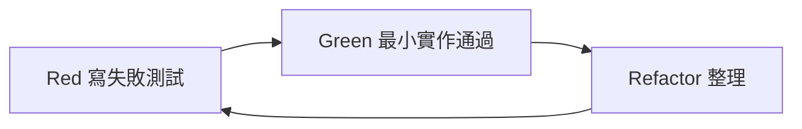
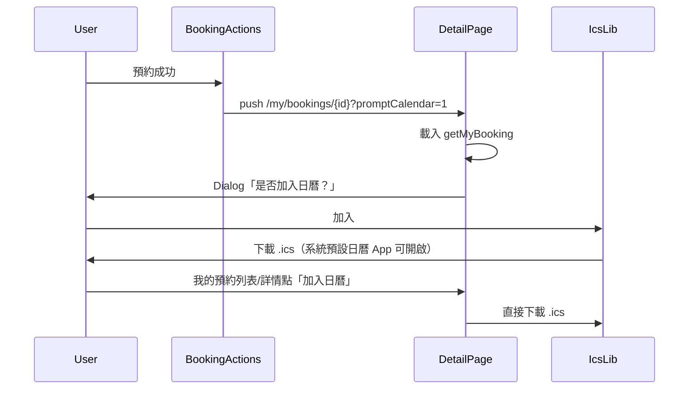
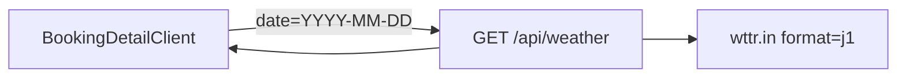

# 預約日曆 (.ics) 與當日天氣功能

## 現況摘要


| 項目    | 現況                                                                                                                                                                     |
| ----- | ---------------------------------------------------------------------------------------------------------------------------------------------------------------------- |
| 預約成功後 | `[booking-actions.tsx](apps/web/src/app/services/[serviceId]/booking-actions.tsx)` 導向 `/my/bookings/{id}`，無後續提示                                                        |
| 我的預約  | `[bookings-list.tsx](apps/web/src/app/my/bookings/bookings-list.tsx)` 僅「查看」；`[booking-detail.tsx](apps/web/src/app/my/bookings/[bookingId]/booking-detail.tsx)` 無日曆/天氣 |
| 服務地點  | DB `services` 無地址欄位；依需求以**常數**預設「台北市信義區」                                                                                                                               |
| 日曆/天氣 | 專案內尚無實作                                                                                                                                                                |
| UI 元件 | 無 Dialog；可新增輕量 `[dialog.tsx](apps/web/src/components/ui/dialog.tsx)` 對齊現有 `Panel` / `Button` 風格                                                                        |


使用者已確認：**天氣僅顯示於預約詳情頁**。

---

## 開發流程：測試先行（TDD）

每個子功能依 **Red → Green → Refactor** 循環；**先提交會失敗的測試**，再寫實作直到 `npm run test --workspace=@booking-scheduler/web`（與必要時 `e2e`）通過。




| 原則    | 說明                                                                  |
| ----- | ------------------------------------------------------------------- |
| 測試即規格 | 測試名稱與 `it(...)` 描述即驗收條件，實作不得偏離                                      |
| 先測後碼  | 禁止先寫完整功能再補測；允許測試檔內 import 尚未存在的模組（編譯失敗可接受，執行時應為失敗而非 skip）           |
| 分層    | 純函式 → Vitest 單元；互動/UI → Testing Library + MSW；關鍵路徑 → Playwright E2E |
| 完成定義  | 該階段所有新增/更新測試綠燈後才算完成                                                 |


---

## 功能一：.ics 日曆（RFC 5545）

### 跨平台支援（iOS / Android / Windows / macOS）

**.ics 是業界通用的 iCalendar 標準（RFC 5545）**，不依賴 Apple 專有格式；同一份檔案可在各平台匯入，**不需為每種 OS 寫不同邏輯或產生不同檔案**。


| 平台           | 典型使用方式                                |
| ------------ | ------------------------------------- |
| iOS / iPadOS | 下載後點開 → 行事曆 App 詢問「加入行事曆」             |
| Android      | 下載後以 Google 日曆 / 三星日曆等「開啟」或「匯入」       |
| Windows      | 下載後以 Outlook、新版「行事曆」App 開啟，或雙擊 `.ics` |
| macOS        | 同 iOS，由「行事曆」App 處理                    |
| 網頁 Gmail     | 可將 `.ics` 當附件匯入 Google 日曆             |


實作策略（維持單一路徑）：

- 前端以 `Blob` + `type: text/calendar;charset=utf-8` 觸發下載，檔名如 `booking-{id}.ics`
- ICS 內容遵守 RFC 5545：`VERSION:2.0`、`METHOD:PUBLISH`、`PRODID`、`VEVENT`、`UID`、`DTSTART`/`DTEND`（UTC `Z` 格式，各 App 會依使用者時區顯示）
- **不採用** `webcal://`、Google Calendar URL、或 `platform` 偵測分流（MVP 複雜度與維護成本高，且 .ics 已涵蓋需求）
- Dialog / 按鈕文案改為中性說明：「下載行程檔後，請以裝置上的日曆 App 開啟並加入。」（避免只寫 iOS）

各平台差異僅在使用者**下載後的手動步驟**（由 OS / 預設 App 決定），網站端行為一致。

### 行為設計




- **檔案格式**：`.ics`（`text/calendar`），非專有 `.cal`；**一份檔案**供 iOS、Android、Windows、macOS 及 Outlook / Google 日曆匯入（見上方跨平台表）。
- **觸發時機**
  1. 預約成功 → 詳情頁帶 `?promptCalendar=1` → 非阻斷 Dialog（加入 / 稍後）
  2. `[bookings-list.tsx](apps/web/src/app/my/bookings/bookings-list.tsx)` 每列新增「加入日曆」
  3. `[booking-detail.tsx](apps/web/src/app/my/bookings/[bookingId]/booking-detail.tsx)` 常駐「加入日曆」按鈕
- **顯示條件**：`status !== 'cancelled'`（`confirmed` / `completed` 皆可再次下載）
- **事件內容**（由 `BookingSummary` 組裝）：


| ICS 欄位              | 來源                                                    |
| ------------------- | ----------------------------------------------------- |
| `SUMMARY`           | `service.name`                                        |
| `DTSTART` / `DTEND` | `slot.startAt` / `slot.endAt`（UTC `YYYYMMDDTHHMMSSZ`） |
| `LOCATION`          | 常數 `台北市信義區`                                           |
| `DESCRIPTION`       | 備註、預約編號                                               |
| `UID`               | `booking-{id}@booking-scheduler`（穩定、可重複下載）            |
| `PRODID`            | `-//Booking Scheduler//ZH-TW//`（提升舊版 Outlook 相容性）     |


`build-booking-ics.ts` 單元測試另驗證：`VERSION:2.0`、`METHOD:PUBLISH`、CRLF 換行（部分 Windows 日曆較穩）。

### 新增檔案（Web `lib` + 元件）


| 檔案                                                                                                                         | 職責                                                                              |
| -------------------------------------------------------------------------------------------------------------------------- | ------------------------------------------------------------------------------- |
| `[apps/web/src/lib/config/service-location.ts](apps/web/src/lib/config/service-location.ts)`                               | `SERVICE_LOCATION_LABEL`、`SERVICE_LOCATION_WTTR_QUERY`（如 `Xinyi,Taipei,Taiwan`） |
| `[apps/web/src/lib/calendar/build-booking-ics.ts](apps/web/src/lib/calendar/build-booking-ics.ts)`                         | 產生 VCALENDAR/VEVENT 字串；函式附單行註解                                                  |
| `[apps/web/src/lib/calendar/download-booking-ics.ts](apps/web/src/lib/calendar/download-booking-ics.ts)`                   | 建立 Blob、`download` 觸發、`URL.revokeObjectURL`                                     |
| `[apps/web/src/components/booking/add-to-calendar-dialog.tsx](apps/web/src/components/booking/add-to-calendar-dialog.tsx)` | 可重用 Dialog + 加入/稍後                                                              |
| `[apps/web/src/components/booking/add-to-calendar-button.tsx](apps/web/src/components/booking/add-to-calendar-button.tsx)` | `variant="secondary"` 按鈕，封裝下載邏輯                                                 |


### 修改既有檔案

1. `[booking-actions.tsx](apps/web/src/app/services/[serviceId]/booking-actions.tsx)`
  `router.push(\`/my/bookings/${id}?promptCalendar=1)`
2. `[booking-detail.tsx](apps/web/src/app/my/bookings/[bookingId]/booking-detail.tsx)`
  - `useSearchParams()` 讀 `promptCalendar`；載入完成且 `booking` 存在時開 Dialog  
  - `router.replace` 清除 query（避免重新整理重複彈窗）  
  - 標題列旁放 `AddToCalendarButton`  
  - 外層 page 以 `Suspense` 包住 client（Next.js `useSearchParams` 要求）
3. `[bookings-list.tsx](apps/web/src/app/my/bookings/bookings-list.tsx)`
  - `actions` 區：`查看` + 條件式 `加入日曆`

### 測試規格（先寫、後實作）

#### Phase 1a — Red：單元測試 `[build-booking-ics.spec.ts](apps/web/src/lib/calendar/build-booking-ics.spec.ts)`

共用 fixture：`bookingFixture`（含 `id`、`service.name`、`slot.startAt/endAt`、`note`）。


| 案例     | 斷言                                                              |
| ------ | --------------------------------------------------------------- |
| 基本結構   | 含 `BEGIN:VCALENDAR`/`END:VCALENDAR`、`BEGIN:VEVENT`/`END:VEVENT` |
| 版本與方法  | `VERSION:2.0`、`METHOD:PUBLISH`                                  |
| 時間     | `DTSTART`/`DTEND` 為 UTC `Z` 且與 fixture ISO 對應                   |
| 地點與標題  | `SUMMARY`、`LOCATION`（台北市信義區）                                    |
| 穩定 UID | `UID:booking-{id}@booking-scheduler`                            |
| 跳脫     | 服務名含 `,` 或 `\` 時仍為合法 ICS                                        |
| 換行     | 使用 `\r\n`（Windows 日曆相容）                                         |


#### Phase 1b — Red：單元測試 `[download-booking-ics.spec.ts](apps/web/src/lib/calendar/download-booking-ics.spec.ts)`


| 案例   | 斷言                                                                                   |
| ---- | ------------------------------------------------------------------------------------ |
| 下載觸發 | mock `URL.createObjectURL` / `<a click>`，Blob `type` 為 `text/calendar;charset=utf-8` |
| 檔名   | `booking-{id}.ics`                                                                   |


#### Phase 1c — Green：實作 lib

`[service-location.ts](apps/web/src/lib/config/service-location.ts)`、`[build-booking-ics.ts](apps/web/src/lib/calendar/build-booking-ics.ts)`、`[download-booking-ics.ts](apps/web/src/lib/calendar/download-booking-ics.ts)` — **直至 Phase 1a/1b 全綠**。

#### Phase 2a — Red：元件測試


| 檔案                                                                                                   | 案例                                                        |
| ---------------------------------------------------------------------------------------------------- | --------------------------------------------------------- |
| `[add-to-calendar-button.spec.tsx](apps/web/src/components/booking/add-to-calendar-button.spec.tsx)` | 點擊呼叫 download；`cancelled` 不渲染                             |
| `[add-to-calendar-dialog.spec.tsx](apps/web/src/components/booking/add-to-calendar-dialog.spec.tsx)` | 開啟顯示文案；「加入」觸發下載；「稍後」關閉                                    |
| `[booking-actions.spec.tsx](apps/web/src/app/services/[serviceId]/booking-actions.spec.tsx)`         | 成功後 `push` 含 `?promptCalendar=1`                          |
| `[bookings-list.spec.tsx](apps/web/src/app/my/bookings/bookings-list.spec.tsx)`（新建）                  | `confirmed` 列有「加入日曆」；`cancelled` 無                        |
| `[booking-detail.spec.tsx](apps/web/src/app/my/bookings/[bookingId]/booking-detail.spec.tsx)`（新建）    | `promptCalendar=1` 載入後出現 Dialog；replace 後 query 清除；常駐按鈕存在 |


#### Phase 2b — Red：E2E `[e2e/tests/member-booking.spec.ts](e2e/tests/member-booking.spec.ts)`


| 案例     | 斷言                        |
| ------ | ------------------------- |
| 預約成功   | 導向詳情且 Dialog「是否加入日曆」可見    |
| 我的預約列表 | 非 cancelled 列有「加入日曆」      |
| 詳情頁    | 「加入日曆」按鈕可見（不驗證 OS 開啟 App） |


#### Phase 2c — Green：實作 UI 與頁面串接

Dialog、Button、三處頁面修改 — **直至 Phase 2a/2b 全綠**。

**不需改 Nest API**：日曆資料已存在 `GET /api/me/bookings` 回應中。

---

## 功能二：預約當日天氣（wttr.in）

### 架構




- **為何用 Next Route Handler**：wttr.in 不適合瀏覽器直連（CORS、User-Agent 限制）；專案目前 Web 無 `app/api`，此功能屬展示型 enrichment，不必擴充 Nest `[app.module.ts](apps/api/src/app.module.ts)`。
- **端點**：`[apps/web/src/app/api/weather/route.ts](apps/web/src/app/api/weather/route.ts)`  
  - Query：`date`（必填，`YYYY-MM-DD`，由 `slot.startAt` 轉 Asia/Taipei 日期）  
  - 上游：`GET https://wttr.in/{SERVICE_LOCATION_WTTR_QUERY}?format=j1`（參考 [wttr.in JSON](https://github.com/chubin/wttr.in#json-output)）  
  - 回傳精簡 JSON，例如：`{ date, locationLabel, avgTempC, minTempC, maxTempC, condition, chanceOfRain }`  
  - 錯誤：502 + 穩定訊息；`revalidate` / `Cache-Control` 短快取（如 30 分鐘）降低對 wttr.in 壓力

### wttr.in 限制與 UI

- 免費 API 預報約 **3 日**；若預約日超出範圍 → 顯示 `Notice`：「目前僅提供近 3 日天氣預報，請出發前再查看。」
- 解析：比對 `weather[].date` 與預約日；取 `hourly` 或 `avgtempC` / `maxtempC` / `mintempC`、`weatherDesc`、`chanceofrain`
- 詳情頁 `[booking-detail.tsx](apps/web/src/app/my/bookings/[bookingId]/booking-detail.tsx)`「時間」區塊下方新增「當日天氣」區（loading / 成功 / 無法取得）

### 新增檔案


| 檔案                                                                                                               | 職責                               |
| ---------------------------------------------------------------------------------------------------------------- | -------------------------------- |
| `[apps/web/src/lib/weather/types.ts](apps/web/src/lib/weather/types.ts)`                                         | 前端消費型別                           |
| `[apps/web/src/lib/weather/fetch-booking-day-weather.ts](apps/web/src/lib/weather/fetch-booking-day-weather.ts)` | `fetch('/api/weather?date=...')` |
| `[apps/web/src/lib/weather/parse-wttr-j1.ts](apps/web/src/lib/weather/parse-wttr-j1.ts)`                         | 從 j1 抽出指定日期（可單測）                 |
| `[apps/web/src/app/api/weather/route.ts](apps/web/src/app/api/weather/route.ts)`                                 | 代理 + 驗證 query（zod）               |


### 測試規格（先寫、後實作）

#### Phase 3a — Red：單元 `[parse-wttr-j1.spec.ts](apps/web/src/lib/weather/parse-wttr-j1.spec.ts)`

使用 `[fixtures/wttr-j1-sample.json](apps/web/src/lib/weather/fixtures/wttr-j1-sample.json)`（從 wttr.in 文件摘錄精簡版）。


| 案例   | 斷言                                                                 |
| ---- | ------------------------------------------------------------------ |
| 命中日期 | `parseWttrJ1ForDate(j1, 'YYYY-MM-DD')` 回傳 `avgTempC`、`condition` 等 |
| 無匹配日 | 回傳 `null`（供 UI 顯示 3 日限制文案）                                         |
| 缺欄位  | 不 throw，回傳 `null` 或部分預設                                            |


#### Phase 3b — Red：Route 測試 `[route.spec.ts](apps/web/src/app/api/weather/route.spec.ts)`


| 案例      | 斷言                                       |
| ------- | ---------------------------------------- |
| 缺少 date | 400 + 穩定 error body                      |
| 合法 date | mock `fetch(wttr.in)` → 200 + 精簡 JSON 形狀 |
| 上游失敗    | 502 + 穩定訊息                               |
| Cache   | 回應含 `Cache-Control`（可選斷言）                |


#### Phase 3c — Red：詳情元件 `[booking-detail.spec.tsx](apps/web/src/app/my/bookings/[bookingId]/booking-detail.spec.tsx)`

MSW：`GET /api/weather?date=...`


| 案例   | 斷言                                   |
| ---- | ------------------------------------ |
| 載入中  | 顯示 loading 文案                        |
| 成功   | 顯示溫度、天氣描述、地點（台北市信義區）                 |
| 超出預報 | API 回 `null` 或 404 → Notice「近 3 日」文案 |
| 失敗   | 502 → 錯誤提示，不影響預約詳情其他區塊               |


#### Phase 3d — Green：實作 weather

types、parse、route、fetch、詳情 UI — **直至 Phase 3a–3c 全綠**。

---

## 文件（Refactor 階段）

- `[docs/frontend_flow.md](docs/frontend_flow.md)`：日曆流程、`promptCalendar`、天氣 3 日限制；與測試案例對齊描述

---

## 總實作順序（測試先行）


| 步驟  | 動作                          | 通過條件                    | 狀態   |
| --- | --------------------------- | ----------------------- | ---- |
| 1   | Red：ICS 單元測試                | `vitest` 失敗（模組不存在或斷言失敗） | 已完成 |
| 2   | Green：ICS lib               | Phase 1a/1b 全綠          | 已完成 |
| 3   | Red：日曆 UI 元件 + E2E          | 失敗                      | 已完成 |
| 4   | Green：日曆 UI + 頁面            | Phase 2a/2b 全綠          | 已完成 |
| 5   | Red：天氣 parse / route / 詳情測試 | 失敗                      | 已完成 |
| 6   | Green：天氣實作                  | Phase 3a–3c 全綠          | 已完成 |
| 7   | Refactor + docs             | 全 suite 綠燈、文件更新         | 待辦   |


執行指令（開發時反覆使用）：

```bash
npm run test --workspace=@booking-scheduler/web
npm run test:watch --workspace=@booking-scheduler/web   # 開發中
# E2E（日曆路徑完成後）
npm exec playwright test e2e/tests/member-booking.spec.ts
```

---

## 風險與緩解


| 風險             | 緩解                                                   |
| -------------- | ---------------------------------------------------- |
| wttr.in 不穩定或限流 | 短快取、優雅降級文案、不阻斷預約主流程                                  |
| 預約日 > 3 天      | 明確提示，不顯示錯誤假資料                                        |
| Dialog 無障礙     | `role="dialog"`、`aria-labelledby`、Esc 關閉、焦點陷阱（基本版即可） |


