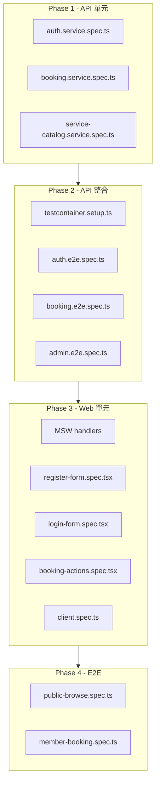

# 自動化測試導入計畫

## 架構總覽



---

## Phase 1 — API 單元測試（vitest + @nestjs/testing）

### 新增套件（`apps/api`）

```
vitest  @vitest/coverage-v8  unplugin-swc  @swc/core
@nestjs/testing  @faker-js/faker
```

> `unplugin-swc` 是 NestJS 裝飾器 + `reflect-metadata` 在 Vitest 下能正常執行的關鍵。

### 新增設定檔

- [`apps/api/vitest.config.ts`](apps/api/vitest.config.ts) — 設定 `globals: true`、`environment: 'node'`、SWC plugin
- [`apps/api/vitest.setup.ts`](apps/api/vitest.setup.ts) — `import 'reflect-metadata'`

### 測試策略

使用 `Test.createTestingModule()` 建立 isolated module，以 `vi.fn()` mock repository，專測 **Service 業務邏輯**，不觸及 DB。

### 新增測試檔案

**`apps/api/src/modules/auth/auth.service.spec.ts`**
- `register`：重複 email 拋 `DUPLICATE_EMAIL`
- `register`：密碼以 argon2id 雜湊後不存明文
- `login`：密碼錯誤拋 `INVALID_CREDENTIALS`
- `getCurrentUser`：無效 token 回 `null`

**`apps/api/src/modules/booking/booking.service.spec.ts`**
- `createBooking`：時段開始時間不足 1 小時後拋 `SLOT_TOO_SOON`
- `cancelMyBooking`：不足 4 小時後開始的預約拋 `BOOKING_NOT_CANCELABLE`
- `cancelMyBooking`：已取消預約拋 `BOOKING_NOT_CANCELABLE`

**`apps/api/src/modules/service-catalog/service-catalog.service.spec.ts`**
- `getPublicService`：serviceId 不存在拋 `NOT_FOUND`
- `getPublicServices`：pagination meta 計算正確

### 新增 npm script（`apps/api/package.json`）

```json
"test": "vitest run",
"test:watch": "vitest"
```

---

## Phase 2 — API 整合測試（Testcontainers + supertest）

### 新增套件（`apps/api`）

```
supertest  @types/supertest  testcontainers  @testcontainers/postgresql
```

### 設定方式

- [`apps/api/vitest.config.ts`](apps/api/vitest.config.ts) — 加入第二個 project `integration`，全域 setup 指向 `test/setup/testcontainer.setup.ts`
- [`apps/api/test/setup/testcontainer.setup.ts`](apps/api/test/setup/testcontainer.setup.ts) — 在 `globalSetup` 啟動 PostgreSQL container、注入 `DATABASE_URL` env、執行 `AppDataSource` migration

### 新增測試檔案

**`apps/api/test/auth.e2e.spec.ts`**
- `POST /api/auth/register` 成功建立會員
- `POST /api/auth/login` 成功取得 `Set-Cookie: booking_session`
- `GET /api/auth/me` 用 cookie 回傳當前使用者
- `POST /api/auth/logout` 清除 session，後續 `/me` 回 401

**`apps/api/test/booking.e2e.spec.ts`**（對應 verify-phase6 重點）
- `POST /api/bookings` 同一時段並發兩次只允許一筆（race condition）
- `POST /api/bookings/:id/cancel` 4 小時規則
- `GET /api/me/bookings` 僅回傳自己的預約
- `GET /api/me/bookings/:id` 他人預約回 403

**`apps/api/test/admin.e2e.spec.ts`**（對應 verify-phase5 重點）
- CRUD 服務、時段（admin token）
- 批次產生時段跳過重複（`skipped > 0`）
- 建立/取消預約後 `booking_status_logs` 寫入

### 新增 npm script

```json
"test:integration": "vitest run --project integration",
"test:all": "vitest run"
```

---

## Phase 3 — Web 元件測試（vitest + Testing Library + MSW）

### 新增套件（`apps/web`）

```
vitest  @vitest/coverage-v8  @vitejs/plugin-react
@testing-library/react  @testing-library/user-event  @testing-library/jest-dom
happy-dom  msw
```

### 新增設定檔

- [`apps/web/vitest.config.ts`](apps/web/vitest.config.ts) — `environment: 'happy-dom'`、`setupFiles`
- [`apps/web/vitest.setup.ts`](apps/web/vitest.setup.ts) — `import '@testing-library/jest-dom'`
- [`apps/web/test/msw/handlers.ts`](apps/web/test/msw/handlers.ts) — MSW handler for `GET /api/auth/me`、`POST /api/auth/login`、`POST /api/bookings` 等
- [`apps/web/test/msw/server.ts`](apps/web/test/msw/server.ts) — `setupServer(...handlers)` + 全域 `beforeAll/afterAll`

### 新增測試檔案

**`apps/web/src/lib/api/client.spec.ts`**
- `apiFetch`：API 回 4xx 拋 `ApiClientError` 含正確 `code`
- `apiFetch`：網路錯誤拋 non-ApiClientError

**`apps/web/src/lib/api/error-messages.spec.ts`**
- `getApiErrorMessage`：已知 code 回對應訊息，未知 code 回 fallback

**`apps/web/src/app/register/register-form.spec.tsx`**
- 填表送出 → MSW 成功回應 → 不顯示錯誤訊息
- 送出 → MSW 回 `DUPLICATE_EMAIL` → 顯示對應錯誤文字

**`apps/web/src/app/login/login-form.spec.tsx`**
- `INVALID_CREDENTIALS` → 顯示錯誤
- 成功登入 → 無錯誤訊息

**`apps/web/src/app/services/[serviceId]/booking-actions.spec.tsx`**
- 點擊預約 → MSW 成功 → button 狀態更新
- MSW 回 `SLOT_ALREADY_BOOKED` → 顯示錯誤

### 新增 npm script（`apps/web/package.json`）

```json
"test": "vitest run",
"test:watch": "vitest"
```

---

## Phase 4 — Playwright E2E（golden paths）

### 新增套件（root）

```
@playwright/test
```

### 新增設定檔

- [`playwright.config.ts`](playwright.config.ts)（root）— `webServer` 同時起 api + web；`baseURL: http://127.0.0.1:3000`；`storageState` 管理 auth cookie
- [`e2e/fixtures/auth.ts`](e2e/fixtures/auth.ts) — `memberPage`/`adminPage` fixture，透過 API 直接登入取得 cookie，避免在每個 test 重跑 UI 登入

### 新增測試檔案

**`e2e/tests/public-browse.spec.ts`**
- 訪客可瀏覽服務列表與詳情
- hidden 服務不出現在公開列表

**`e2e/tests/member-booking.spec.ts`**（取代 verify-phase6 E2E 段落）
1. 註冊新帳號
2. 登入 → 看到 `/my/bookings`
3. 瀏覽服務 → 點選時段 → 建立預約
4. 進入預約詳情 → 取消預約
5. 確認狀態顯示 `cancelled`

### 新增 npm script（root `package.json`）

```json
"test:api": "npm run test -w apps/api",
"test:web": "npm run test -w apps/web",
"test:e2e": "playwright test",
"test": "npm run test:api && npm run test:web"
```

---

## Phase 5 — 遷移 verify scripts（漸進式）

`verify-phase5.mjs`（37 項）與 `verify-phase6.mjs`（23 項）改為透過測試框架執行：

| 原腳本 | 遷移目標 |
|--------|---------|
| Phase 5 migration 驗證 | `admin.e2e.spec.ts` 的 testcontainer globalSetup |
| Phase 5 Admin CRUD + audit log | `admin.e2e.spec.ts` 對應 spec |
| Phase 6 race condition | `booking.e2e.spec.ts` |
| Phase 6 rate limit | `booking.e2e.spec.ts`（需設 throttle config 為測試值）|
| Phase 6 E2E golden path | `e2e/tests/member-booking.spec.ts` |

完成遷移後，可從 root `scripts/` 移除 verify-phase*.mjs，CI 改跑 `npm test && npm run test:e2e`。
