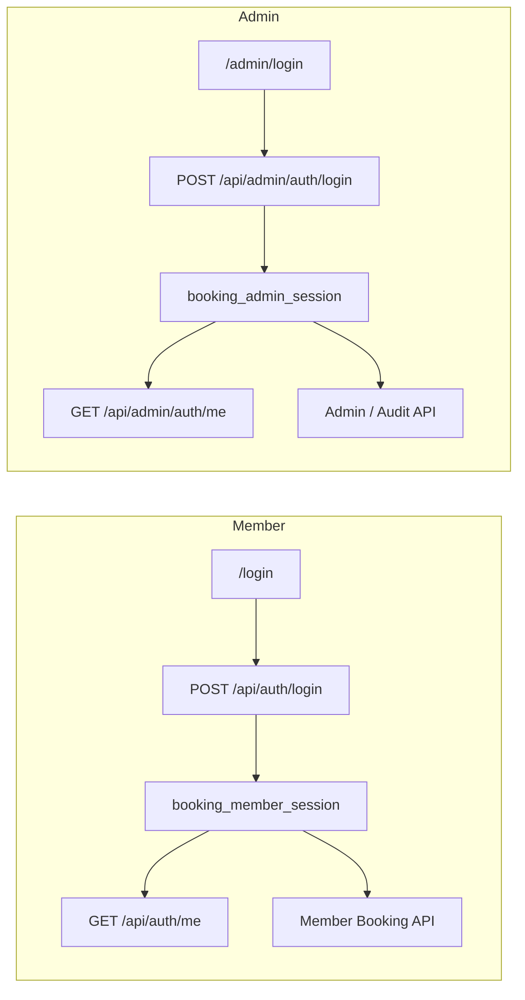
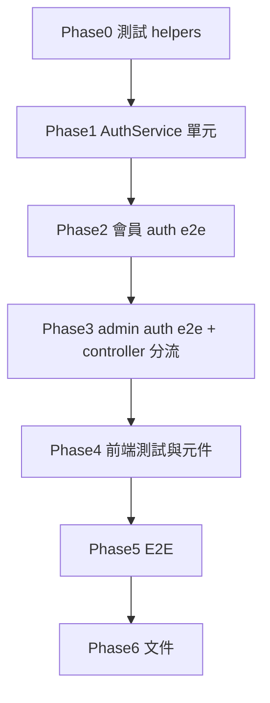

# 前台／後台登入狀態分離（TDD 計畫）

## 目標與邊界

- **目標**：同一瀏覽器可同時存在「會員登入」與「後台登入」兩條獨立 session；登入／登出／`me` 互不干擾。
- **不變**：`users` 表、密碼驗證、server-side session + HttpOnly Cookie、`sessions` 表結構（Phase 1 **不加** `audience` 欄位；兩顆 cookie = 兩列 session）。
- **產品預設**（與先前討論一致）：admin 帳號仍可在 `[/login](apps/web/src/app/login/login-form.tsx)` 走會員登入取得 **member** session；後台僅能透過 `[/admin/login](apps/web/src/app/admin/(auth)`/login/admin-login-form.tsx) 取得 **admin** session。




| Cookie | 常數建議                                             |
| ------ | ------------------------------------------------ |
| 會員     | `booking_member_session`（取代現有 `booking_session`） |
| 後台     | `booking_admin_session`                          |


---

## TDD 總流程（每階段重複）

```text
1. 列出測試情境（本文件各 Phase）
2. 撰寫／調整測試 → npm run test:api / test:web / test:e2e → 預期 RED
3. 最小實作使該 Phase 測試 GREEN
4. 必要時重構（抽共用 parse cookie，不重複六處 readSessionToken）
```

建議指令：

- API：`npm run test:api -w apps/api`（或專案根 `npm run test:api`）
- Web：`npm run test:web`
- E2E：`npm run test:e2e`（需 DB）

---

## Phase 0：測試基礎設施（與 Phase 1 測試一併 RED）

**變更測試 helper（尚無實作時全部會 fail）**

- `[apps/api/test/helpers/http.ts](apps/api/test/helpers/http.ts)`：支援 `parseSessionCookie(response, 'member' | 'admin')`、`sessionCookieHeader(token, audience)`；保留舊名 `booking_session` 的測試改為 member。
- `[e2e/helpers/constants.ts](e2e/helpers/constants.ts)`：`MEMBER_SESSION_COOKIE_NAME`、`ADMIN_SESSION_COOKIE_NAME`。
- `[e2e/helpers/api.ts](e2e/helpers/api.ts)`：新增 `loginAdminUser()` → `POST /api/admin/auth/login`；`registerAndLoginAdmin()` = register + promote + admin login。
- `[e2e/fixtures/auth.ts](e2e/fixtures/auth.ts)`：`adminTest` 改用 admin cookie；`memberTest` 改用 member cookie。

---

## Phase 1：後端 AuthService 單元測試（RED → GREEN）

**檔案**：`[apps/api/src/modules/auth/auth.service.spec.ts](apps/api/src/modules/auth/auth.service.spec.ts)`

### 測試情境


| ID     | 情境                                                   | 預期                           |
| ------ | ---------------------------------------------------- | ---------------------------- |
| SVC-01 | `getSessionCookieName('member')`                     | `booking_member_session`     |
| SVC-02 | `getSessionCookieName('admin')`                      | `booking_admin_session`      |
| SVC-03 | `login(..., 'member')` 成功                            | `createSession` 被呼叫；回傳 token |
| SVC-04 | `loginAsAdmin` / `login(..., 'admin')` 且 `role=user` | `FORBIDDEN`（或專用碼，與 e2e 一致即可） |
| SVC-05 | `loginAsAdmin` 且 `role=admin`                        | 成功建立 session                 |
| SVC-06 | `getCurrentUser(token, 'member')` 有效                 | 回傳 user                      |
| SVC-07 | `getCurrentUser(undefined, 'admin')`                 | `UNAUTHENTICATED`            |
| SVC-08 | `logout(token, 'member')`                            | 只 `revokeSession` 對應 hash    |
| SVC-09 | 既有 register / INVALID_CREDENTIALS / USER_DISABLED 案例 | 行為不變                         |


### 實作要點（GREEN 時）

- `[auth.service.ts](apps/api/src/modules/auth/auth.service.ts)`：`SessionAudience = 'member' | 'admin'`；`getSessionCookieName(audience)`；`login` 加可選 `audience`（預設 `member`）；`loginAsAdmin` 內建 `role === 'admin'` 檢查。
- 新增 `[apps/api/src/common/auth/session-cookie.ts](apps/api/src/common/auth/session-cookie.ts)`（建議）：`readSessionTokenFromRequest(request, cookieName)`，供 controller / rate-limit 共用。

---

## Phase 2：後端 API 整合測試 — 會員 Auth（RED → GREEN）

**檔案**：`[apps/api/test/auth.e2e.spec.ts](apps/api/test/auth.e2e.spec.ts)`

### 測試情境


| ID        | 情境                                            | 預期                                                    |
| --------- | --------------------------------------------- | ----------------------------------------------------- |
| AUTH-M-01 | `POST /api/auth/login`                        | Set-Cookie 僅 `booking_member_session`（無 admin cookie） |
| AUTH-M-02 | `GET /api/auth/me` 帶 member cookie            | 200                                                   |
| AUTH-M-03 | `POST /api/auth/logout`                       | 清除 member cookie；同 token `/me` → 401                  |
| AUTH-M-04 | `GET /api/auth/me` 僅帶 **admin** cookie        | 401（混用防線）                                             |
| AUTH-M-05 | 既有 register / 錯誤密碼 / rate limit / HttpOnly 屬性 | 更新 cookie 名後仍通過                                       |


### 實作要點

- `[auth.controller.ts](apps/api/src/modules/auth/auth.controller.ts)`：login/logout/me 只讀寫 **member** cookie 名。

---

## Phase 3：後端 API 整合測試 — 後台 Auth + 隔離（RED → GREEN）

**新檔案**：`apps/api/test/admin-auth.e2e.spec.ts`

### 測試情境


| ID        | 情境                                        | 預期                                                                                             |
| --------- | ----------------------------------------- | ---------------------------------------------------------------------------------------------- |
| AUTH-A-01 | `POST /api/admin/auth/login`（admin 帳號）    | `booking_admin_session`                                                                        |
| AUTH-A-02 | `GET /api/admin/auth/me` 帶 admin cookie   | 200，`role=admin`                                                                               |
| AUTH-A-03 | `POST /api/admin/auth/login`（一般會員）        | 403，**不** Set admin cookie                                                                     |
| AUTH-A-04 | `POST /api/admin/auth/logout`             | 只清 admin cookie；admin `/me` 401                                                                |
| AUTH-A-05 | `GET /api/admin/services` 僅 member cookie | 401 或 403（與現有 `[admin.e2e](apps/api/test/admin.e2e.spec.ts)` 語意一致；建議 **401** 若無 admin session） |
| AUTH-A-06 | `GET /api/admin/services` 僅 admin cookie  | 200                                                                                            |
| AUTH-A-07 | 同一 user：先 member login 再 admin login      | 兩 cookie 並存；member `/me` 與 admin `/me` 皆 200                                                   |
| AUTH-A-08 | admin logout 後                            | member `/me` 仍 200；admin `/me` 401                                                             |
| AUTH-A-09 | member logout 後                           | admin `/me` 仍 200；member `/me` 401                                                             |


### 實作要點

- 新增 `AdminAuthController`：`@Controller('admin/auth')`，掛在 `[AuthModule](apps/api/src/modules/auth/auth.module.ts)`。
- `[booking.controller.ts](apps/api/src/modules/booking/booking.controller.ts)`：`getCurrentUser` 只讀 **member** cookie。
- `[admin.controller.ts](apps/api/src/modules/admin/admin.controller.ts)`、`[audit-log.controller.ts](apps/api/src/modules/audit-log/audit-log.controller.ts)`：`requireAdmin` 只讀 **admin** cookie。
- `[contract-rate-limit.guard.ts](apps/api/src/common/rate-limit/contract-rate-limit.guard.ts)`：依 path 選 cookie（`/api/admin` → admin；其餘 → member）；admin 登入 rate limit 可複用 login 規則（IP+email）。

### 調整既有整合測試（同一 Phase GREEN）

- `[admin.e2e.spec.ts](apps/api/test/admin.e2e.spec.ts)`：`registerAndLogin` + promote 後改 `**POST /api/admin/auth/login`** 取 admin token；「一般 member 呼叫 Admin API」改帶 **member** cookie（預期 401/403）。
- `[booking.e2e.spec.ts](apps/api/test/booking.e2e.spec.ts)`：確認仍用 member login helper。

---

## Phase 4：前端單元／元件測試（RED → GREEN）

### 測試情境


| ID     | 檔案                                                                  | 情境                                              | 預期                                                      |
| ------ | ------------------------------------------------------------------- | ----------------------------------------------- | ------------------------------------------------------- |
| WEB-01 | 新建 `admin-login-form.spec.tsx`                                      | 成功登入                                            | 呼叫 `POST .../api/admin/auth/login`，導向 `/admin/bookings` |
| WEB-02 | 同上                                                                  | 非 admin 403                                     | 顯示無權限；**不**呼叫 logout 補救                                 |
| WEB-03 | `[login-form.spec.tsx](apps/web/src/app/login/login-form.spec.tsx)` | MSW 仍 mock `/api/auth/login`                    | 行為不變                                                    |
| WEB-04 | 新建 `get-current-user.spec.ts`（可選）                                   | `getCurrentAdminUser` mock `/api/admin/auth/me` | 與 audience 參數一致                                         |


### 實作要點

- `[get-current-user.ts](apps/web/src/lib/auth/get-current-user.ts)`：`getCurrentMemberUser` / `getCurrentAdminUser`（或 `audience` 參數）。
- `[admin-login-form.tsx](apps/web/src/app/admin/(auth)`/login/admin-login-form.tsx)：改 admin auth 路徑；移除 login→me→logout 流程。
- `[admin/(dashboard)/layout.tsx](apps/web/src/app/admin/(dashboard)`/layout.tsx)、`[admin/(auth)/login/page.tsx](apps/web/src/app/admin/(auth)`/login/page.tsx)：只用 `getCurrentAdminUser`。
- `[admin-logout-button.tsx](apps/web/src/components/admin/admin-logout-button.tsx)`：`POST /api/admin/auth/logout`。
- `[apps/web/test/msw/handlers.ts](apps/web/test/msw/handlers.ts)`：補 admin auth handlers。

---

## Phase 5：E2E（RED → GREEN）

### 測試情境


| ID     | 檔案                                                           | 情境                                              | 預期                                |
| ------ | ------------------------------------------------------------ | ----------------------------------------------- | --------------------------------- |
| E2E-01 | `[admin-flow.spec.ts](e2e/tests/admin-flow.spec.ts)`         | 非 admin 僅 **member** cookie 進 `/admin/services` | 仍顯示無權限（UI 行為不變）                   |
| E2E-02 | 同上                                                           | `adminTest` 使用 **admin** cookie                 | golden path 通過                    |
| E2E-03 | 新建或擴充 `session-isolation.spec.ts`                            | admin 僅 member 登入 → `/admin/bookings`           | redirect `/admin/login`           |
| E2E-04 | 同上                                                           | admin 後台登入後前台 `/my/bookings`                    | 未登入則導向 `/login`（無 member session） |
| E2E-05 | `[member-booking.spec.ts](e2e/tests/member-booking.spec.ts)` | cookie 名改為 member                               | 既有流程通過                            |


---

## Phase 6：文件與契約（實作完成後）

- `[docs/api_contract.md](docs/api_contract.md)`：新增 Admin Auth 三端點；member cookie 更名。
- `[docs/frontend_flow.md](docs/frontend_flow.md)` §8.1：後台改 `POST /api/admin/auth/login` 等。
- `[docs/test_scenarios.md](docs/test_scenarios.md)`：新增 TC-AUTH-SESSION-* 對照上表 ID。
- `[README.md](README.md)`：cookie／端點表更新。
- `[docs/verification_checklist.md](docs/verification_checklist.md)`：勾選雙 session 項目。

---

## 實作順序總覽（與 TDD 對齊）




---

## 風險與注意

- **Breaking change**：所有依賴 `booking_session` 的腳本、手動 Postman、舊 e2e 需一併更新。
- **Secure cookie**：本地若 API 非 HTTPS，`secure: true` 可能影響 cookie 寫入（與現況相同，不另開 scope）。
- **403 vs 401**：`POST /api/admin/auth/login` 非 admin 建議 **403 FORBIDDEN**；Admin API 無 admin cookie 建議 **401 UNAUTHENTICATED**（與現有 member 測「無 session」一致）。

