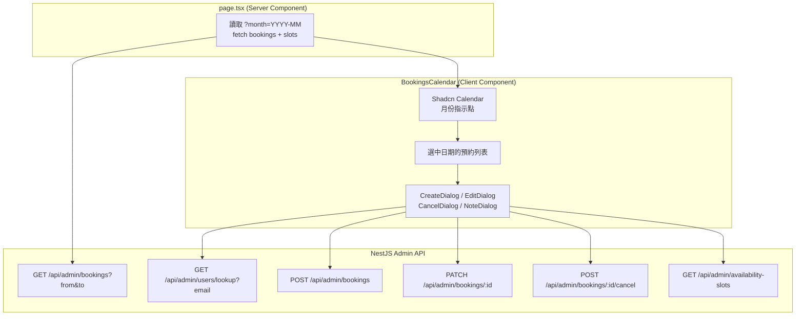

# 後台預約管理功能增強（TDD）

## TDD 執行原則

- **後端**：先在 `[apps/api/test/admin.e2e.spec.ts](apps/api/test/admin.e2e.spec.ts)` 加入 `it` 測試案例（此時 API 不存在，會 fail）→ 實作 → `npm run test:e2e` 全綠
- **前端 API**：先在 `[apps/web/src/lib/admin/admin-api.spec.ts](apps/web/src/lib/admin/admin-api.spec.ts)`（新建）用 MSW 描述預期行為 → 實作函式 → `npm test` 全綠
- **前端 Dialog**：先寫 `*.spec.tsx` 測試 submit 流程與 error state → 實作元件 → `npm test` 全綠

---

## 架構概覽




---

## 後端變更（先 Red → 再 Green）

### 1. 新增 User Email Lookup

**先寫測試（Red）** — 在 `admin.e2e.spec.ts` 加入：

```ts
it('GET /api/admin/users/lookup 可依 email 查詢會員', async () => { ... }); // 200
it('GET /api/admin/users/lookup email 不存在時回 404', async () => { ... });
it('GET /api/admin/users/lookup 非 admin 時回 403', async () => { ... });
```

`**[admin.repository.ts](apps/api/src/modules/admin/admin.repository.ts)**`

- 新增 `findActiveUserByEmail(email)` → `{ id, email, displayName } | null`

`**[admin.service.ts](apps/api/src/modules/admin/admin.service.ts)**`

- 新增 `lookupUserByEmail(email)` → 找不到拋 404

`**[admin.controller.ts](apps/api/src/modules/admin/admin.controller.ts)**`

- 新增 `GET admin/users/lookup?email=...`

### 2. 擴充「改期」功能

**先寫測試（Red）** — 在 `admin.e2e.spec.ts` 加入：

```ts
it('PATCH /api/admin/bookings/:id 可改期至同服務的可用時段', async () => { ... }); // 200 + audit log
it('PATCH /api/admin/bookings/:id 改期至不可用時段回 409', async () => { ... });
it('PATCH /api/admin/bookings/:id 改期寫入 admin.booking.reschedule audit log', async () => { ... });
```

**再實作（Green）**

`[admin.dto.ts](apps/api/src/modules/admin/admin.dto.ts)`

- `UpdateAdminBookingDto` 加入 `@IsOptional() @IsUUID() availabilitySlotId?: string`

`**[admin.repository.ts](apps/api/src/modules/admin/admin.repository.ts)`**

- 新增 `updateBookingSlot(queryRunner, bookingId, newSlotId)` — UPDATE bookings SET availability_slot_id + service_id

`**[admin.service.ts](apps/api/src/modules/admin/admin.service.ts)**`

- `updateBooking` 擴充：若有 `availabilitySlotId`，在 transaction 內驗證新時段（`available`、無衝突）→ 更新 → 寫 `admin.booking.reschedule` audit log（before/after slotId）
- note 更新邏輯維持不變（無 transaction，寫 `admin.booking.update` audit log）

---

## 前端變更（先 Red → 再 Green）

### 3. 安裝依賴 + Calendar 元件

```bash
npm install react-day-picker --workspace=apps/web
```

**新建 `[apps/web/src/components/ui/calendar.tsx](apps/web/src/components/ui/calendar.tsx)`**

- 包裝 `DayPicker`（react-day-picker v9），套用專案 Tailwind 設計 tokens
- Props：`selected`、`onSelect`、`month`、`onMonthChange`、`modifiers`（用於標示有預約的日期）

### 4. 更新 `admin-api.ts`

**先寫測試（Red）** — 新建 `[apps/web/src/lib/admin/admin-api.spec.ts](apps/web/src/lib/admin/admin-api.spec.ts)`，每個函式一個 describe，用 MSW `server.use(...)` 模擬 API 回應：

```ts
describe('createAdminBooking', () => {
  it('POST 成功時回傳 AdminBooking', async () => { ... });
  it('API 回 409 時拋 ApiClientError', async () => { ... });
});
describe('lookupAdminUserByEmail', () => {
  it('找到時回傳 user', async () => { ... });
  it('404 時拋 ApiClientError', async () => { ... });
});
// ...其他函式
```

**再實作（Green）** — `[apps/web/src/lib/admin/admin-api.ts](apps/web/src/lib/admin/admin-api.ts)`

新增以下 client-side 呼叫函式（不帶 cookieHeader，Client Component 呼叫）：

- `getAdminBookingsByDateRange(from, to)` — GET /api/admin/bookings 帶 from/to
- `createAdminBooking({ userId, availabilitySlotId, note? })`
- `updateAdminBooking(bookingId, { note?, availabilitySlotId? })`
- `cancelAdminBooking(bookingId, { reason? })`
- `lookupAdminUserByEmail(email)` — GET /api/admin/users/lookup?email=
- `getAdminAvailableSlots(serviceId)` — GET /api/admin/availability-slots?status=available&serviceId=

### 5. 更新 `page.tsx`

`**[apps/web/src/app/admin/(dashboard)/bookings/page.tsx](apps/web/src/app/admin/(dashboard)`/bookings/page.tsx)**

- 讀取 `searchParams.month`（預設當月 `YYYY-MM`）
- 呼叫 `getAdminBookings` 帶 `from`/`to`（整月範圍）
- 渲染 `<BookingsCalendar initialBookings={...} month={...} />`

### 6. 新建 `bookings-calendar.tsx`（Client Component）

`**[apps/web/src/app/admin/(dashboard)/bookings/bookings-calendar.tsx](apps/web/src/app/admin/(dashboard)`/bookings/bookings-calendar.tsx)**

UI 佈局：

- 上方右側：「新增預約」按鈕
- 左側：`<Calendar>` 月曆，有預約的日期顯示指示點（藍點）
- 右側：選中日期的預約列表，每筆顯示：服務、會員、時段、狀態 badge + 操作按鈕（更改備註 / 改期 / 取消）
- 月份切換 → `router.push('?month=YYYY-MM')`
- 操作完成 → `router.refresh()` 重新載入 Server Component 資料

### 7. Dialog 元件

**先寫測試（Red）** — 每個 dialog 建立對應 `*.spec.tsx`，測試關鍵 submit 流程：

```ts
// create-booking-dialog.spec.tsx
it('輸入 email 並查詢後可看到會員名稱', async () => { ... });
it('選擇時段並送出後呼叫 createAdminBooking', async () => { ... });
it('API 回錯誤時顯示 FormError', async () => { ... });

// cancel-booking-dialog.spec.tsx
it('填入原因並確認後呼叫 cancelAdminBooking', async () => { ... });
// update-note-dialog.spec.tsx / edit-booking-dialog.spec.tsx 同理
```

**再實作（Green）** — 均放在 `apps/web/src/app/admin/(dashboard)/bookings/` 目錄：

- `create-booking-dialog.tsx` — 輸入 Email 查詢會員 → 選擇可用時段 → 填備註 → 送出
- `update-note-dialog.tsx` — 顯示現有備註 → 允許修改 → 送出（已有 audit log）
- `edit-booking-dialog.tsx` — 顯示當前時段 → 選同服務的其他可用時段 → 送出改期
- `cancel-booking-dialog.tsx` — 確認對話框，填入取消原因 → 送出

所有 dialog 共用專案現有 `<Dialog>`、`<Form>`、`<FormField>`、`<TextInput>`、`<Button>` 元件。