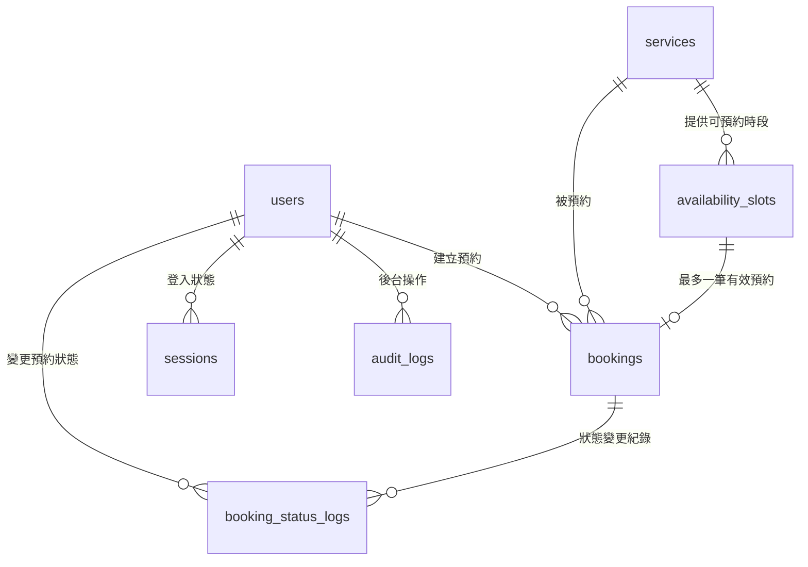

# 預約排程系統 DB Schema 設計

## 1. 設計目標

本文件定義預約排程系統 MVP 的資料庫結構。資料庫使用 PostgreSQL，時間統一儲存 UTC，前端依使用者時區顯示。

本設計需支援：

- 訪客查看公開服務與可預約時段
- 會員建立、查看、取消自己的預約
- 管理員管理服務、時段與所有預約
- 一個時段只能有一筆有效預約
- 同一會員不可重複預約同一時段
- 服務可區分啟用、停用、隱藏
- Server-side session 搭配 HttpOnly Cookie

## 2. 資料表關係圖




## 3. 狀態定義

### 3.1 user_role


| 值     | 說明   |
| ----- | ---- |
| user  | 一般會員 |
| admin | 管理員  |


### 3.2 user_status


| 值        | 說明        |
| -------- | --------- |
| active   | 可正常登入與使用  |
| disabled | 停用帳號，不可登入 |


### 3.3 service_status


| 值        | 前台列表 | 公開詳情 API | 可被預約 | 說明             |
| -------- | ---- | -------- | ---- | -------------- |
| active   | 顯示   | 可回傳      | 可以   | 正常服務           |
| inactive | 顯示   | 可回傳      | 不可   | 停用服務，需清楚標示不可預約 |
| hidden   | 不顯示  | 不回傳      | 不可   | 隱藏服務，只能由後台管理   |


### 3.4 availability_slot_status


| 值         | 說明          |
| --------- | ----------- |
| available | 可預約         |
| blocked   | 暫時封鎖，例如內部保留 |
| inactive  | 停用，不再開放預約   |


### 3.5 booking_status


| 值         | 說明   |
| --------- | ---- |
| confirmed | 預約成立 |
| cancelled | 預約取消 |
| completed | 預約完成 |


MVP 不保留 pending。使用者成功建立預約後，預設直接進入 confirmed。

### 3.6 booking_cancelled_by


| 值     | 說明     |
| ----- | ------ |
| user  | 會員自行取消 |
| admin | 管理員取消  |


## 4. Tables

### 4.1 users

儲存會員與管理員帳號。


| 欄位            | 型別           | 必填  | 說明              |
| ------------- | ------------ | --- | --------------- |
| id            | uuid         | 是   | 主鍵              |
| email         | varchar(255) | 是   | 登入 email，唯一     |
| password_hash | text         | 是   | argon2id 雜湊後的密碼 |
| display_name  | varchar(100) | 是   | 顯示名稱            |
| role          | user_role    | 是   | 預設 user         |
| status        | user_status  | 是   | 預設 active       |
| created_at    | timestamptz  | 是   | 建立時間            |
| updated_at    | timestamptz  | 是   | 更新時間            |


限制：

- `email` 必須唯一
- 會員註冊後直接啟用，MVP 不做 email 驗證
- 停用帳號使用 `disabled`，不直接刪除使用者

## 4.2 services

儲存服務項目。


| 欄位               | 型別             | 必填  | 說明                      |
| ---------------- | -------------- | --- | ----------------------- |
| id               | uuid           | 是   | 主鍵                      |
| name             | varchar(120)   | 是   | 服務名稱                    |
| description      | text           | 否   | 服務說明                    |
| image_url        | text           | 否   | 服務主圖 URL                |
| duration_minutes | integer        | 是   | 服務時長，單位為分鐘              |
| price            | integer        | 是   | 台幣整數，例如 1200 代表 NT$1200 |
| status           | service_status | 是   | 預設 active               |
| created_at       | timestamptz    | 是   | 建立時間                    |
| updated_at       | timestamptz    | 是   | 更新時間                    |


限制：

- `duration_minutes` 必須大於 0
- `price` 不可小於 0
- 圖片檔案不存 DB，DB 只存 `image_url`
- MVP 只支援一張主圖，暫不建立 service_images 多圖表

## 4.3 availability_slots

儲存實際可被預約的時間格子。


| 欄位         | 型別                       | 必填  | 說明             |
| ---------- | ------------------------ | --- | -------------- |
| id         | uuid                     | 是   | 主鍵             |
| service_id | uuid                     | 是   | 關聯 services.id |
| start_at   | timestamptz              | 是   | 時段開始時間，UTC     |
| end_at     | timestamptz              | 是   | 時段結束時間，UTC     |
| status     | availability_slot_status | 是   | 預設 available   |
| created_at | timestamptz              | 是   | 建立時間           |
| updated_at | timestamptz              | 是   | 更新時間           |


限制：

- `end_at` 必須大於 `start_at`
- 一個時段只開放一人預約，因此 MVP 不需要 `capacity`
- 使用者只能預約開始時間至少在 1 小時後的時段
- 後台建立時段時，需確認時段長度符合服務的 `duration_minutes`
- 已停用或隱藏服務不可建立新的可預約時段

使用方式：

- `availability_slots` 代表實際存在的可預約時段
- 前台查詢服務詳情時，從這張表取得未來可預約時間
- MVP 採用手動或批次產生時段，不使用複雜排班規則

批次產生範例：

```text
服務：個人諮詢
時長：60 分鐘
規則：週一到週五 09:00-12:00、14:00-18:00
產生：未來 30 天的 availability_slots
```

## 4.4 bookings

儲存預約資料。


| 欄位                   | 型別                   | 必填  | 說明                       |
| -------------------- | -------------------- | --- | ------------------------ |
| id                   | uuid                 | 是   | 主鍵                       |
| user_id              | uuid                 | 是   | 關聯 users.id              |
| service_id           | uuid                 | 是   | 關聯 services.id           |
| availability_slot_id | uuid                 | 是   | 關聯 availability_slots.id |
| status               | booking_status       | 是   | 預設 confirmed             |
| note                 | text                 | 否   | 使用者或後台備註                 |
| cancelled_at         | timestamptz          | 否   | 取消時間                     |
| cancelled_by         | booking_cancelled_by | 否   | 取消來源                     |
| cancel_reason        | text                 | 否   | 取消原因                     |
| created_at           | timestamptz          | 是   | 建立時間                     |
| updated_at           | timestamptz          | 是   | 更新時間                     |


限制：

- 同一 `availability_slot_id` 只能有一筆非 cancelled 預約
- 同一 `user_id` 不可對同一 `availability_slot_id` 建立重複的非 cancelled 預約
- 會員只能取消自己 4 小時後才開始的預約
- 管理員可替任意會員建立、編輯、取消預約
- 管理員不受會員的「1 小時後可預約」與「4 小時前可取消」限制

## 4.5 booking_status_logs

記錄預約狀態變更歷史。


| 欄位          | 型別             | 必填  | 說明             |
| ----------- | -------------- | --- | -------------- |
| id          | uuid           | 是   | 主鍵             |
| booking_id  | uuid           | 是   | 關聯 bookings.id |
| from_status | booking_status | 否   | 原狀態            |
| to_status   | booking_status | 是   | 新狀態            |
| changed_by  | uuid           | 否   | 關聯 users.id    |
| reason      | text           | 否   | 變更原因           |
| created_at  | timestamptz    | 是   | 建立時間           |


用途：

- 記錄 `confirmed -> cancelled`
- 記錄 `confirmed -> completed`
- 保留會員或管理員變更預約狀態的歷史

## 4.6 sessions

儲存 server-side session。


| 欄位                 | 型別          | 必填  | 說明                   |
| ------------------ | ----------- | --- | -------------------- |
| id                 | uuid        | 是   | 主鍵                   |
| user_id            | uuid        | 是   | 關聯 users.id          |
| session_token_hash | text        | 是   | session token 雜湊值，唯一 |
| expires_at         | timestamptz | 是   | 過期時間                 |
| revoked_at         | timestamptz | 否   | 失效時間                 |
| created_at         | timestamptz | 是   | 建立時間                 |


Session 流程：

- 登入成功後，後端產生隨機 session token
- Cookie 存 session token，並設定 HttpOnly、Secure、SameSite=Lax
- DB 只存 `session_token_hash`，不存明文 token
- 登出時設定 `revoked_at`
- 後端驗證登入時，需確認 session 未過期且未 revoked

`revoked_at` 的意思是 session 被主動失效，例如登出或後台強制登出。

## 4.7 audit_logs

記錄重要後台操作。


| 欄位            | 型別           | 必填  | 說明              |
| ------------- | ------------ | --- | --------------- |
| id            | uuid         | 是   | 主鍵              |
| actor_user_id | uuid         | 否   | 操作者，關聯 users.id |
| action        | varchar(100) | 是   | 操作名稱            |
| target_type   | varchar(100) | 是   | 操作對象類型          |
| target_id     | uuid         | 否   | 操作對象 ID         |
| metadata      | jsonb        | 否   | 補充資料            |
| ip_address    | inet         | 否   | 操作者 IP          |
| user_agent    | text         | 否   | 操作者瀏覽器資訊        |
| created_at    | timestamptz  | 是   | 建立時間            |


用途：

- 記錄 admin 建立、編輯、停用、隱藏服務
- 記錄 admin 建立、編輯、取消預約
- 記錄重要權限或資料異動

## 5. 建議索引

### users

- `email` unique index

### services

- `(status)`

用途：

- 查詢前台可顯示服務時，排除 hidden

### availability_slots

- `(service_id, start_at)`
- `(start_at, status)`

用途：

- 查詢某服務的未來可預約時段
- 排除過去、停用、封鎖時段

### bookings

- `(user_id, created_at DESC)`
- `(availability_slot_id)` partial unique index，條件為 `status <> 'cancelled'`
- `(user_id, availability_slot_id)` partial unique index，條件為 `status <> 'cancelled'`

用途：

- 查詢會員自己的預約
- 保證一個時段最多一筆有效預約
- 保證同一會員不可重複預約同一時段

### sessions

- `session_token_hash` unique index
- `(user_id, expires_at)`

用途：

- 透過 Cookie token 查找登入狀態
- 查詢使用者有效 session

### audit_logs

- `(actor_user_id, created_at DESC)`
- `(target_type, target_id)`

用途：

- 查詢某管理員操作紀錄
- 查詢某筆資料的異動紀錄

## 6. 預約建立交易規則

會員建立預約時，後端需在 transaction 中完成以下流程：

```text
1. 驗證使用者已登入
2. 驗證使用者狀態為 active
3. 鎖定指定 availability_slots
4. 驗證 slot.status = available
5. 驗證 service.status = active
6. 驗證 slot.start_at 至少晚於目前時間 1 小時
7. 驗證該 slot 尚無非 cancelled booking
8. 建立 booking，status = confirmed
9. 建立 booking_status_logs
10. commit
```

管理員建立預約時：

- 可以替任意會員建立預約
- 不受「1 小時後可預約」限制
- 仍需避免同一時段產生多筆有效預約
- 仍需寫入 booking_status_logs 與 audit_logs

## 7. 取消預約規則

會員取消預約時：

```text
1. 驗證使用者已登入
2. 確認 booking 屬於目前使用者
3. 確認 booking.status = confirmed
4. 確認 slot.start_at 至少晚於目前時間 4 小時
5. 將 booking.status 更新為 cancelled
6. 寫入 cancelled_at、cancelled_by、cancel_reason
7. 建立 booking_status_logs
```

管理員取消預約時：

- 可取消任意會員預約
- 不受「4 小時前可取消」限制
- 需寫入 booking_status_logs 與 audit_logs

## 8. Public API 查詢規則

前台服務列表：

- 回傳 `active` 與 `inactive`
- 不回傳 `hidden`
- `inactive` 需讓前端清楚標示不可預約

前台服務詳情：

- `active` 可回傳
- `inactive` 可回傳，但不可預約
- `hidden` 不回傳

前台可預約時段：

- 只回傳 service.status = active 的時段
- 只回傳 slot.status = available 的時段
- 只回傳開始時間至少在 1 小時後的時段
- 排除已有非 cancelled booking 的時段

## 9. 暫不納入 MVP 的資料表

以下資料表可等第二階段再加入：

- service_images：多張服務圖片
- availability_rules：規則式排班
- holidays：例外休假日
- payments：付款紀錄
- notifications：Email / SMS 通知紀錄
- waitlists：候補名單

